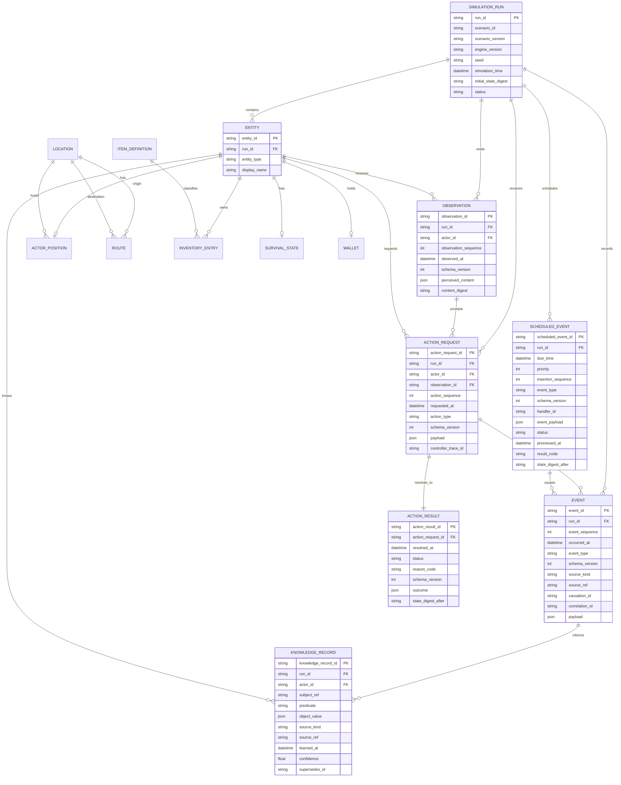

# ERD and Persistence Model

이 문서는 기술별 DDL이 아니라 0.1의 논리 데이터 모델과 소유권을 정의한다. 관계형 저장소를 가정한 표기는 예시이며 구현 기술이 바뀌어도 연구 핵심 기록의 정체성과 관계는 유지한다.

## 1. 분류 원칙

### Core persistence

실행 identity, 시간, entity identity, scheduler와 module version처럼 엔진 수명주기를 지탱하는 데이터다.

### Research-critical first-class records

`Event`, `Observation`, `ActionRequest`, `ActionResult`, `KnowledgeRecord`는 임의 component JSON이나 단일 log blob 안에 묻지 않는다. 각각 안정적 ID, run/time/sequence, schema version과 추적 관계를 가진 독립 레코드로 저장한다. 확장 payload는 JSON일 수 있지만 envelope과 핵심 index field는 명시적 column이다.

### Module-owned state/tables

Location/Route, actor position, inventory 등 domain canonical state는 소유 Module만 변경한다. 범용 Entity row에 모든 상태를 넣지 않는다.

## 2. 논리 ERD

## 3. Core persistence 상세

- **SimulationRun:** scenario/engine version, seed, simulation time, initial state digest와 상태를 보존한다.
- **Entity:** run 안의 최소 identity다. 도메인 속성 저장소가 아니다.
- **ScheduledEvent:** 아직 실행되지 않은 system/world event input을 보존한다. 숨겨진 scheduler 상태이며 Observation·Knowledge·World Truth query에는 노출되지 않는다. due time에는 System/Event Handler가 직접 처리하며 ActionRequest로 materialize하지 않는다. event type/schema, handler, 처리 결과와 state digest를 보존한다.
- **ModuleVersion/RunModule**(도식 생략): run에 활성화된 module ID, version, configuration digest를 기록한다.

## 4. 연구 핵심 레코드 상세

- **Event:** `(run_id, event_sequence)` unique. `source_kind/source_ref`로 ActionRequest, ScheduledEvent 또는 자연 발생 trigger를 구분한다. 발생한 사실과 transition 결과만 기록하며 미래 예약을 Event로 가장하지 않는다.
- **Observation:** Controller에 실제 전달된 immutable envelope을 그대로 보존한다. actor, simulation time, ordering, schema와 digest를 포함한다.
- **ActionRequest:** Actor/Controller가 제출한 정규화된 행동 의도만 보존한다. actor와 Observation 관계는 필수이며 ScheduledEvent나 자연 발생 World Event를 넣지 않는다. 거부된 요청도 삭제하지 않는다.
- **ActionResult:** 정상 처리된 요청과 1:1이며 `SUCCEEDED`, `REJECTED`, `FAILED` 같은 status와 안정적 reason code를 가진다. 실패 시 해당 action의 성공 mutation은 없다. duration 동안 독립적으로 commit된 system mutation과 경과 시간은 유지한다. 예상 밖 engine 오류는 결과를 조작하지 않고 예외로 전파한다.
- **KnowledgeRecord:** actor별 주장/사실 인식의 출처, 획득 시각, 확신도와 정정 계보를 가진다. 동일 subject에 대한 상충 지식을 허용할 수 있으며 World Truth와 FK로 동일시하지 않는다.

LLM trial 분석에는 별도 **ControllerInvocation** 레코드를 둘 수 있다. `controller_trace_id`, model/provider, prompt version, parameters, memory policy/version, Observation ID, raw response 참조, parse status와 ActionRequest ID를 보존한다. provider 비밀값이나 인증정보는 저장하지 않는다.

## 5. Module-owned state 예시

- **movement:** `Location`, `Route`, `ActorPosition`. Route는 endpoints, traversal cost와 현재 passability를 가진다.
- **knowledge:** `KnowledgeRecord`와 선택적 정규화 index. 연구 핵심 envelope 소유자이기도 하다.
- **inventory:** `ItemDefinition`, `InventoryEntry`.
- **survival:** `SurvivalState`의 최소 hunger/fatigue 등. 실제 필드는 해당 milestone에서 확정한다.
- **trade:** `Wallet`, `Offer` 또는 최소 price listing. 통화 의미는 trade module이 소유한다.
- **social:** 대화/전달 Event를 사용하며 별도 상태가 필요할 때만 table을 추가한다.

## 6. 원자성·무결성

- actor action과 system event는 서로 다른 handler를 사용하지만, 각 engine transition은 validation 이후 canonical mutation, 결과 provenance, Event append와 직접 유발된 Knowledge update를 공통 transaction/mutation boundary에서 commit한다.
- invalid Action은 ActionRequest와 REJECTED ActionResult만 기록하고 domain state/Event를 부분 생성하지 않는다. 감사 Event가 필요하면 domain Event와 분리된 명시적 기록 정책을 사용한다.
- M2 시작 거부의 비교 기준은 제출 tick까지 due system event를 처리한 뒤의 상태다. 완료 조건 실패는 FAILED 결과만 추가하고 이미 경과한 시간·독립적인 system commit을 rollback하지 않는다.

- FK만으로 정보 권한을 표현하지 않는다. Observation 생성 query 자체가 actor scope를 강제한다.
- replay 비교용 state digest는 연구 log와 비결정적 metadata를 제외한 canonical state의 정규화 직렬화로 계산한다.

## 7. M1 구현 범위

M1은 위 논리 모델 중 RunManifest, ScheduledEvent, Event, 최소 ActionRequest/ActionResult와 system handler outcome에 대응하는 in-process envelope만 구현한다. 아직 concrete SQLite table이나 domain state table을 만들지 않는다.

- canonical state는 module state를 수용할 수 있는 JSON object이나 M1에는 domain key 의미가 없다.
- handler에는 canonical object 자체가 아니라 분리된 snapshot을 전달하고, 성공한 TransitionPlan만 공통 mutation 경계에서 반영한다.
- Event와 handler 결과는 run-local deterministic sequence 및 source/causation/correlation으로 연결된다.
- 최소 ActionRequest도 필수 `based_on_observation_id`를 보존한다. Observation record와 FK 검증은 M3 이전에 임시 구현하지 않으며 M1에서는 opaque identifier 계약만 강제한다.
- M1 state digest는 canonical state만 포함하고 future schedule, Event log, RNG bookkeeping과 run metadata는 포함하지 않는다. replay report는 Event ordering, handler results, logical time과 RNG draw count를 별도로 비교할 수 있다.
- 구체 persistence schema, first-class research record 저장과 transaction projection은 해당 record 수명주기 요구가 구체화되는 milestone에서 추가한다.

## 8. M2 실제 in-memory 상태

아래 값은 기존 canonical JSON state에 저장한다. 위 논리 ERD를 SQLite schema로 구현한 것은 아니다.

| 소유자 / canonical 경로 | record |
|---|---|
| Core `entities[entity_id]` | `{entity_id, entity_type}` |
| movement `movement.locations[location_id]` | `{location_id}` |
| movement `movement.routes[route_id]` | `{route_id, origin, destination, traversal_cost, passable}` |
| movement `movement.positions[actor_id]` | `{actor_id, location_id}` |

identity는 비어 있지 않은 문자열이며 run 안에서 안정적이다. initial state builder는 중복 ID와 잘못된 location 참조를 거부한다. Route는 단방향이고 traversal_cost는 양의 정수 tick, passable은 bool이다. MOVE handler는 raw canonical record도 시작과 완료에 다시 검증한다. Entity에는 위치를 넣지 않으며, runtime 위치 변경은 movement가 만든 TransitionPlan을 공통 mutation boundary에서 적용한다.

ActionTiming의 duration과 검증 데이터는 canonical state에 저장하지 않는 파생 값이다. ActionResult는 `started_at`, `resolved_at`, `status`, `reason_code`를 추가하고 실패일 때 `transition=None`으로 기록한다. 실패는 domain Event나 deterministic ID를 소비하지 않는다. state digest에는 Entity와 movement 상태가 포함되며 timing·clock·scheduler·Event·결과 log는 포함되지 않는다. 이 값들은 replay에서 별도로 비교한다.

## 9. M3 실제 in-memory first-class 기록

M3는 SQLite table을 추가하지 않는다. World Truth는 계속 kernel canonical snapshot이며 다음 기록은 독립된 in-memory envelope/ledger다.

| 기록 / 소유자 | 실제 필드와 수명주기 |
|---|---|
| Observation / Core envelope, application history | `observation_id, run_id, actor_id, observation_sequence, simulation_time, schema_version, content_digest`; immutable canonical content. 성공 generation 때만 run-local sequence를 소비하고 append |
| KnowledgeRecord / knowledge module | `knowledge_record_id, run_id, actor_id, subject_ref, predicate, value, source_kind, source_ref, learned_at, supersedes_id?, schema_version` |
| ActionTrace / application | `attempt_sequence, request: ActionRequest, result: ActionResult?, controller_result?, boundary_reason?, error_type?`. live 요청 시도와 대응 결과를 연결 |

KnowledgeLedger 생성에는 run ID, manifest start tick과 **명시적인 초기 기록**만 제공한다. stable record ID와 source kind/ref는 시나리오 작성자가 제공하는 문자열이며 UUID/자동 truth seed를 만들지 않는다. learned_at은 시작 tick 이하이고 source는 빈 문자열일 수 없다. subject_ref/value는 World Truth FK나 pointer가 아니며 존재하지 않는 대상에 관한 주장도 표현할 수 있다. 별도 confidence 필드나 자동 확신도 조정은 없다.

record ID는 run 내 유일하며 조회 순서는 `(learned_at, knowledge_record_id)`다. supersedes는 같은 run/actor/subject/predicate의 현재 ledger에 있는 이전 또는 동일 tick 기록을 가리켜야 한다. unknown reference, 미래 predecessor, cycle과 actor 간 계보를 거부한다. 원본을 삭제·rewrite하지 않고 상충 기록과 정정 계보를 모두 history/query에 반환한다. 자동 winner 선택은 없다. `for_actor(actor_id)`는 자기 기록만 복사한 ActorKnowledgeView를 만들며 그 view에는 actor selector나 ledger handle이 없다. 빈 query는 UNKNOWN을 뜻하고 전 세계 unknown row를 만들지 않는다.

Observation과 Knowledge는 서로 다른 store다. observe/MOVE/WAIT/system event가 초기 Knowledge를 자동 수정하거나 append하지 않는다. Controller와 Research가 읽은 nested JSON을 수정해도 ledger와 저장된 trace는 바뀌지 않는다. M3에는 runtime knowledge writer가 없으며 M4/M5의 관찰/정보 전달 기반 갱신은 검증된 handler 및 공통 transaction과 함께 설계해야 한다. EventBus subscriber의 kernel 재진입 또는 Observation builder의 raw state mutation으로 우회하지 않는다.

초기 Knowledge와 Observation/ActionTrace는 기존 kernel state digest 및 engine replay input에 포함되지 않는다. 연구자가 live Observation stream까지 재현하려면 동일한 명시적 초기 지식, pipeline 설정과 actor별 observe 호출 순서/tick도 보관해야 한다. M1/M2 engine replay는 기록된 ActionRequest만으로 충분하다. 이 milestone은 별도 영속 저장·복구 또는 resume 기능을 제공하지 않는다.
